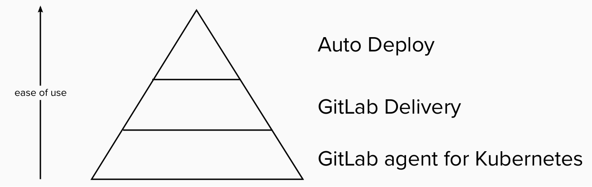
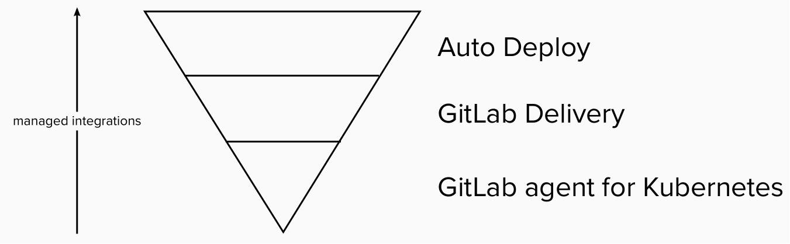

- TOC
{:toc}

## Deployment Management

| | |
| --- | --- |
| Stage | [Deploy](/direction/delivery/) |
| Maturity | [viable](/direction/#maturity) |
| Content Last Reviewed | `2023-04-04` |

### Introduction and how you can help
<!-- Introduce yourself and the category. Use this as an opportunity to point users to the right places for contributing and collaborating with you as the PM -->

Welcome to the direction page of the Deployment Management product category of GitLab. This page is part of the bigger [Delivery direction](/direction/delivery). It is owned by the Environments group and is maintained by Viktor Nagy ([Email](mailto:vnagy@gitlab.com)).

Your feedback helps us building a world-class deployment management offering in GitLab. We welcome your feedback in [issues](https://gitlab.com/groups/gitlab-org/-/issues/?sort=updated_desc&state=opened&label_name%5B%5D=Category%3ADeployment%20Management&first_page_size=20), [epics](https://gitlab.com/groups/gitlab-org/-/epics?state=opened&page=1&sort=start_date_desc&label_name[]=Category:Deployment+Management) and are always open to user interviews to learn more about your use cases or share more details about our roadmap. You can register a call with us through your GitLab account manager or customer support.

-->
### Overview
<!-- Describe your category so that someone who is not familar with the market space can understand what the product does.
-->

The scope of the Deployment Management category is everything related to deploying your code to its target infrastructure. It includes every possible target infrastructure from mainframes to mobiles store, serverless providers, VMs or Kubernetes.

At GitLab we call the target infrastructure that a deployment targets an Environment. As Environments are a central part of [Delivery](/direction/delivery) that include both Deployment and Release functionalities, we have a [dedicated direction to improve the environments](/direction/delivery/environment_management) offering.

Deployment management includes every aspect of deployments. Without aiming for a full list of the scope, it includes:

- cloud-native deployments,
- non cloud-native deployments,
- mobile deployments,
- deployments across multiple projects and groups,
- compliance requirements for deployments,
- etc.

### Strategy and Themes
<!-- Capture the main problems to be solved in market (themes). Describe how you intend to solve these with GitLab (strategy). Provide enough context that someone unfamiliar with the details of the category can understand what is being discussed. -->

Managing an organization's deployments is a major challenge. Particularly in larger organizations, with the proliferation of services, technologies, dependencies on one side, and compliance and security requirements on the other side, many teams find themselves struggling to deploy frequently and consistently in a repeatable manner.

Platform teams want to help development teams become more efficient; so that they can meet compliance and security requirements and deploy to environments they can't (and probably shouldn't) access directly, without slowing down their ability to implement changes to their applications.

We envision a fully declarative, scalable, modular, testable approach to deployment management that supports any major target infrastructure from bare metal servers to container orchestrators to edge devices and mobile app stores.

Declarative operations is to the devops pipeline what serverless is to infrastructure. It shifts the responsibility of operating the underlying systems from the developer to provider, and enables the user to focus on their business instead. The provider of these functionalities is often a platform team. We want to simplify the life of a platform team by supporting them with tools and frameworks.

The biggest difficulty with every automation tool is that it is code. As a result it requires developers to write it, a runtime environment to run it and a lot of investment into learning the tool chain. Compare this to the declarative nature of Kubernetes. With Kubernetes everyday developers realised that operations are complex, but operations were complex even before Kubernetes. Kubernetes, with its declarative, everything as data approach made this complexity approachable for every developer.

At the same time, Kubernetes made it clear that higher-level abstractions are required for developers without compromising the core flexibility of the container orchestrator. This is a learning we want to build on and provide a framework and conventions that allow for a platform out of the box.

We envision our solution to have several layers in terms of user value and complexity.

Today, we focus our efforts on the Gitlab Agent for Kubernetes. The agent provides great flexibility, but does not offer any out of the box, white-glove experiences for less experienced users. We want to add higher layers of abstractions on top of the agent.

The second layer, what we call GitLab Delivery on the previous image, includes various integations, and a framework that supports platform teams to build out their own solutions, potentially replacing parts of the tool chain we integrate with. This layer should integrate well with other GitLab stages, especially around Package, Release and Secrets management.

The third layer, that is closest to the current Auto Deploy offering, provides a conventions based, fully-managed solution for our users. It can be approached from two different angles. First, from the software developers' point of view, it's a black box that should "just work" and provides a full delivery process from ephemeral environments to production. Second, from the platform engineers' point of view, it's a customized version of the GitLab Delivery layer. It allows minor modifications and customizations that as long as the conventions are followed provide a GitLab supported platform.

As we increase the value managed by GitLab, we need to increase the complexity owned by GitLab. At the agent level, we are responsible for the core cluster connection only. To best understand the agent, one should think of it as not providing any user-level features. It is responsible for maintaining a bi-directional communication channel between a cluster and GitLab. At this level, we try avoid 3rd party integrations as much as possible to minimize our maintenance costs and build an extremely reliable foundation for higher-level features. We add various features on top of the core connection, like the Flux integration, push-based deployments, security scanning, direct access of cluster resources from the GitLab UI, etc.

At the GitLab Delivery level, we need to pick at least a few tools and integrate those into our offering. The set of tools likely includes an ingress, a secrets management solution, a certificate management solution, support for advanced deployment strategies and integrations with GitLab Observability. At this level, we need to build out integrations and conventions that simplify the work of a platform engineer and can serve all our users.

On top of GitLab Delivery, Auto DevOps requires even more integrations. At this stage the vision is that the end user provides us a Dockerfile or a container and we return them a URL where they can check out their application. On top of the integrations mentioned under GitLab Delivery, we would likely want to add integrations with even more specific tools, like Knative and a Service Mesh. As the Auto DevOps codifies an opinionated process, we should aim to serve 80% of our users out of the box, and allowing the remaining 20% to be served by the GitLab Delivery framework.

Finally, expanding the scope of Auto Deploy to other deployment targets, mobile for example, likely requires a totally new set of integrations. At the same time, we should want to build a generic Delivery framework that works with any target infrastructure.

### 1 year plan
<!--
1 year plan for what we will be working on linked to up-to-date epics. This section will be most similar to a "road-map". Items in this section should be linked to issues or epics that are up to date. Indicate relative priority of initiatives in this section so that the audience understands the sequence in which you intend to work on them.
 -->

Our plan for the following year includes three major directions:

1. Integrating Flux with the GitLab agent for Kubernetes
1. Be ready to remove the certificate-based integration
1. Shipping a Kubernetes Dashboard integrated into GitLab
1. Delivering the first version of the GitLab deployment project template and the GitLab delivery framework

#### Integrating Flux with the GitLab agent for Kubernetes

[We decided in January 2023 to use Flux as the recommended approach for doing GitOps with GitLab](https://about.gitlab.com/blog/2023/02/08/why-did-we-choose-to-integrate-fluxcd-with-gitlab/). While [Flux](https://fluxcd.io/) is a mature CNCF project, we see plenty of ways to improve the user experience around it by integrating it with GitLab. Primarily, we plan to:

- [simplify and centralize Flux to GitLab access management](https://gitlab.com/gitlab-org/gitlab/-/issues/389393)
- [simplify setting up Flux triggers](https://gitlab.com/gitlab-org/gitlab/-/issues/392852)
- [trigger and track Flux reconciliation from CI](https://gitlab.com/gitlab-org/gitlab/-/issues/405007)

Besides the above concrete plans, we are researching the best approach

- [to install and manage the agent and Flux together](https://gitlab.com/gitlab-org/gitlab/-/issues/388460)

#### Be ready to remove the certificate-based integration

We compiled [a list of issues](https://gitlab.com/gitlab-org/configure/general/-/issues/199) that block the final removal of the certificate-based cluster integration functionality, deprecated in GitLab 14.7. We plan to ship a solution to these issues to unblock the removal. If we manage to follow our plan, we would like to remove the certificate-based cluster integration in GitLab 18.0.

Some users are unable to transition to the agent for Kubernetes, because their [clusters can not access their GitLab instance](https://gitlab.com/gitlab-org/gitlab/-/issues/350943). With the certificate-based integration, GitLab reached out to the cluster to carry out its tasks. While the agent-based setup supports both directions to send a message, the initial connection today is set up starting from the cluster. We want to lift this requirement to unblock all our users in their journey with the agent for Kubernetes.

Another important theme in this area is the replacement of [GitLab managed clusters](https://gitlab.com/gitlab-org/gitlab/-/issues/297004). GitLab managed clusters allow automatic namespace and service account creation and have conventions from review/ephemeral environments to production. This functionality is not supported yet with the agent infrastructure. We are looking into approaches how to provide a similar experience.

#### Shipping a Kubernetes Dashboard integrated into GitLab

Besides providing basic cluster insights as part of the environments. We want to provide a complete [Kubernetes dashboard as part of GitLab](https://gitlab.com/groups/gitlab-org/-/epics/2493). This should allow users to simplify and secure their operations as engineers won't need direct access to clusters for troubleshooting.

The dashboard will provide insights about all the resources available in the cluster with related events, log tailing and - when appropriate - pod terminal functionality.

#### The GitLab deployment project template and the GitLab delivery framework

##### GitLab Deployment project

This theme is currently being researched and architected. We plan to provide a Deployment management project built-into GitLab.

A core building block of Deployment management is a GitLab project to store the declarative deployment definitions in a structure following GitLab-defined conventions and using the GitLab agent for Kubernetes, to consume the content stored in a GitLab Deployment management project. A Deployment management project is supported by GitLab as long as it follows the GitLab conventions.

A note to help understand the management project: This approach we imagine is similar to various frontend tools, like "Create React App", "Expo" (React Native). These tools provide a simplified experience out of the box for 80% of the use cases. If the user needs more flexibility, they can [eject](https://create-react-app.dev/docs/available-scripts#npm-run-eject). Thus, the user owns their project, but a lot of complexity remains hidden from them to support them focusing on their business problem. This is aligned with [the convention over configuration product principle](https://handbook.gitlab.com/handbook/product/product-principles/#convention-over-configuration) of GitLab.

The Deployment management project should describe:
- a list of environments
- agents for Kubernetes managing the deployments
- manifests, Helm charts for all the managed environments
- the deployment process, including how deployments might be promoted between environments
- notification sinks on various deployment related events

The Deployment management project might include:
- secrets in encrypted form (e.g. with SOPS or Sealed Secrets)
- metrics descriptions
- release automation, optionally connected with metrics

The features from this area closely related to [our Environment management direction](/direction/environment_management).

##### GitLab Delivery framework

This section shares our plans towards simplifying the Delivery experience for our users . This direction is currently being researched and architected. It will very likely change.

The GitLab Delivery framework is an opinionated selection of tools to support platform teams in providing white-glove delivery experiences to software developers.

| Ease of use | Complexity |
| --- | --- |
|    |   |

The more user friendly GitLab makes a solution, the more complexity we become responsible for. Increasing complexity means increasing maintenance costs and higher customer value.

The agent for Kubernetes is the core building block of the GitLab Delivery framework on Kubernetes. With its Flux integration, it provides a reliable, production ready tool for cluster connection and declarative deployment management of Kubernetes clusters.
The GitLab Delivery framework extends our product offering on top of the agent for Kubernetes.

The GitLab Delivery framework plans to offer a customizable selection of shared cluster tools from ingress to observability integrated across GitLab.
We need to pick at least a few tools and integrate those into our offering. The set of tools likely includes an ingress, a secrets management solution, a certificate management solution, support for advanced deployment strategies and integrations with GitLab Observability.
The framework should integrate well with other GitLab offering, especially around packages, secrets management and security.

The GitLab Delivery framework will be integrated with the Deployment management project. The two working together should support

- a customizable framework to implement company-specific processes and policies for the platfrom engineers,
- fully automated and integrated delivery pipelines for the software engineering teams.

#### What is next for us
<!-- This is a 3 month look ahead for the next iteration that you have planned for the category. This section must provide links to issues or
or to [epics](https://handbook.gitlab.com/handbook/product/product-processes/#epics-for-a-single-iteration) that are scoped to a single iteration. Please do not link to epics encompass a vision that is a longer horizon and don't lay out an iteration plan. -->

We are working towards [introducing services](https://gitlab.com/groups/gitlab-org/-/epics/11048) into GitLab and the design of [the delivery framework](https://gitlab.com/gitlab-org/ci-cd/deploy-stage/environments-group/general/-/wikis/ideas/Delivery-framework-requirements).

#### What we are currently working on
<!-- Scoped to the current month. This section can contain the items that you choose to highlight on the kickoff call. Only link to issues, not Epics.  -->

We are working on [improving the Flux - GitLab integration](https://gitlab.com/gitlab-org/gitlab/-/issues/389393), making [Flux reconciliation to show up in a pipeline](https://gitlab.com/groups/gitlab-org/-/epics/10866) and providing a [full-featured Kubernetes dashboard built into GitLab](https://gitlab.com/groups/gitlab-org/-/epics/11112).

#### What we recently completed
<!-- Lookback limited to 3 months. Link to the relevant issues or release post items. -->

We worked mostly on the Flux and cluster UI integrations. As a result, we provide users with

- [extensive guidance on using Flux with GitLab](https://docs.gitlab.com/ee/user/clusters/agent/gitops.html)
- [cluster insights as part of GitLab environments pages including Flux reconciliation status](https://docs.gitlab.com/ee/ci/environments/kubernetes_dashboard.html)
- [removed the need for Flux notification configuration when Flux reconciles an agent configuration project](https://docs.gitlab.com/ee/user/clusters/agent/gitops.html#immediate-git-repository-reconciliation)
- [local access to their clusters with their GitLab identity](https://docs.gitlab.com/ee/user/clusters/agent/user_access.html#access-a-cluster-with-the-kubernetes-api)

#### What is Not Planned Right Now
<!--  Often it's just as important to talk about what you're not doing as it is to
discuss what you are. This section should include items that people might hope or think
we are working on as part of the category, but aren't, and it should help them understand why that's the case.
Also, thinking through these items can often help you catch something that you should
in fact do. We should limit this to a few items that are at a high enough level so
someone with not a lot of detailed information about the product can understand -->

In the deployment management scope, we don't plan to

- Improve our deployment capabilities unrelated to Kubernetes. Note that we believe some features mentioned above will be useful for other deployment targets, and we don't want to limit such usage.
- Improve the current advanced deployment capabilities (blue-green and canary deployments) of GitLab.
- Improve Kubernetes integrations features not related to deployments. Note that other teams might work on related features in their areas.

A separate single-engineering group works on [mobile DevOps](https://handbook.gitlab.com/handbook/engineering/development/incubation/mobile-devops/), including deployments to mobile stores.

### Best in Class Landscape
<!-- Blanket description consistent across all pages that clarifies what GitLab means when we say "best in class" -->

BIC (Best In Class) is an indicator of forecasted near-term market performance based on a combination of factors, including analyst views, market news, and feedback from the sales and product teams. It is critical that we understand where GitLab appears in the BIC landscape.

#### Key Capabilities
<!-- For this product area, these are the capabilities a best-in-class solution should provide -->

A BIC deployment management solution should provide a fully declarative, scalable, modular, testable approach to deployment management with an easy to understand GUI that describes the current status of a deployment process.

#### Roadmap
<!-- Key deliverables we're focusing on to build a BIC solution. List the epics by title and link to the epic in GitLab. Minimize additional description here so that the epics can remain the SSOT.
 This may be duplicative to the 1 year section however for some categories the key deliverables required to become the BIC solution will extend beyond one year and we want to capture all of the gaps.
 Moreover, the 1 year section may contain work that is not directly related to closing gaps if we are already the BIC or if we are differentiating ourselves.-->

- [External CI jobs](https://gitlab.com/groups/gitlab-org/-/epics/10866) to improve pipeline integration with any 3rd party tool, including Flux
- [Simplify Flux token management](https://gitlab.com/gitlab-org/gitlab/-/issues/389393)
- [Remove the cert-based integration](https://gitlab.com/gitlab-org/configure/general/-/issues/199)
- [Ship a dashboard for Kubernetes](https://gitlab.com/groups/gitlab-org/-/epics/11112)
- [Ship the deliver framework](https://gitlab.com/gitlab-org/ci-cd/deploy-stage/environments-group/general/-/wikis/ideas/Delivery-framework-requirements)

#### Top [1/2/3] Competitive Solutions
<!-- PMs can choose to highlight a primary BIC competitor--or more, if no single clear winner in the category exists; in this section we should indicate: 1. name of competitive product, 2. links to marketing website and documentation, 3. why we view them as the primary BIC competitor -->

1. [Argo project with Argo Rollouts](https://argoproj.github.io/)
1. [Harness](https://harness.io/)
1. [Spinnaker](https://spinnaker.io/)

### Target Audience
<!--
List the personas (https://handbook.gitlab.com/handbook/marketing/strategic-marketing/roles-personas#user-personas) involved in this category.

Look for differences in user's goals or uses that would affect their use of the product. Separate users and customers into different types based on those differences that make a difference.
-->

The primary persona is [the Platform Engineer](https://handbook.gitlab.com/handbook/product/personas/#priyanka-platform-engineer). Their job is to support all the development teams with standardised and compliant pipelines.

The secondary personas are [the Application Operator](https://handbook.gitlab.com/handbook/product/personas/#allison-application-ops) and [the Compliance Manager](https://handbook.gitlab.com/handbook/product/personas/#cameron-compliance-manager). The Application Operator is responsible for deploying and operating the business applications, while the compliance manager assures that all the processes follow internal policies.

Deployments don't live in a vacuum, but are part of a companies delivery process. They are preceded and followed by CI jobs, are surrounded by security checks and guardrails, are integrated with monitoring and work in coordination with release management. We created [a user story map](https://app.mural.co/t/gitlab2474/m/gitlab2474/1642001078399/2dfb4a6a7307e42f2a2e42f0e10f49dc83bdfbae?wid=0-1647471145120) to highlight and discuss these cross-stage and intra-group jobs and integration requirements.

### Pricing and Packaging
<!--
-->

This section establishes the pricing alignment scaffolding for this category based on GitLab's [buyer-based tiering](https://handbook.gitlab.com/handbook/company/pricing/#buyer-based-tiering-clarification).

##### Free

Managing deployments using existing CI/CD features, such as using `include` will continue to be free. For a large number of GitLab users, from individual developers to small companies, this is sufficient.

Most GitOps and agent for Kubernetes features are available under Free as long as using the agent's in-cluster Service Account is used.

##### Premium

Features that require special permissions will fall under the Premium tier. This includes deployment approvals or cluster access impersonating a GitLab user's identity.

Features targeting a dedicated platform team fall under the Premium tier. While platform engineers are individual contributors, they do not contribute directly to the business. Their contribution is indirect, through increased developer productivity, security and reliability. Thus a platform teams assumes a non-IC decision maker who expects a level of standardization across several teams.

##### Ultimate

Helping organizations with a standards-based and compliant deployment pipeline is critically important that gets the attention of CIOs. Dashboards that summarize compliance and empower leaders with a birds-eye-view of their entire organization's change management solves a fundamental problem for GitLab's largest customers.

Security guardrails and policy attestation support and reporting fall under this category.

Strong collaboration requirements with partially locked release artifacts fall under the Ultimate tier.

### Analyst Landscape

- [Gartner: Innovation Insight for Continuous Infrastructure Automation](https://drive.google.com/file/d/1FljgIPROwmt47e2ziG4_Qw3rXwyGKb0E/view) (internal)
