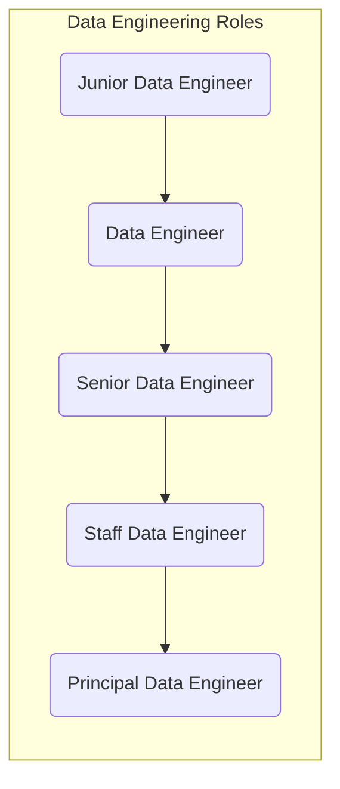
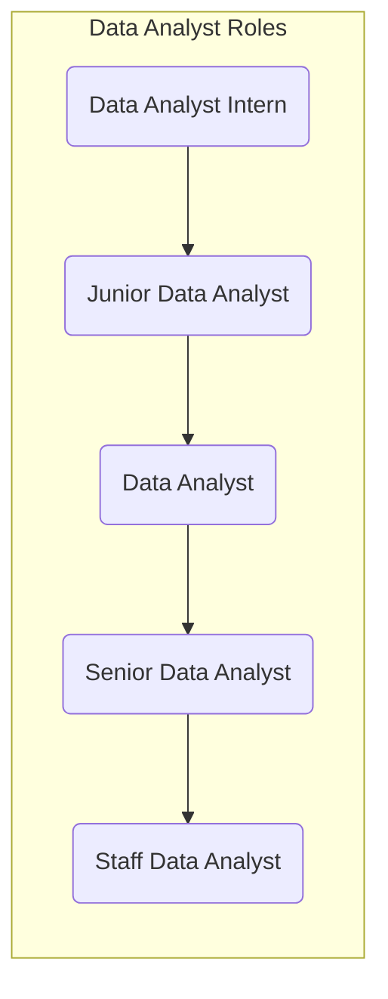
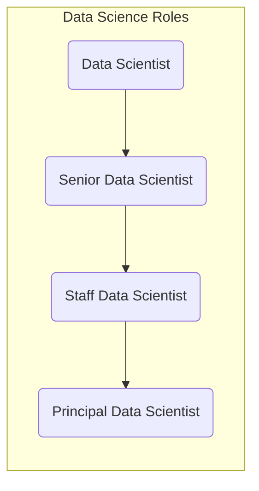
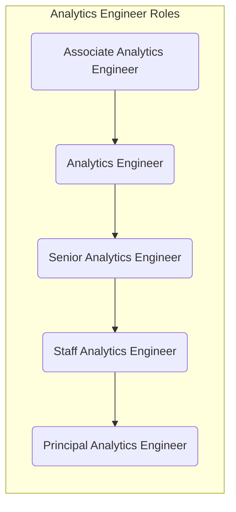
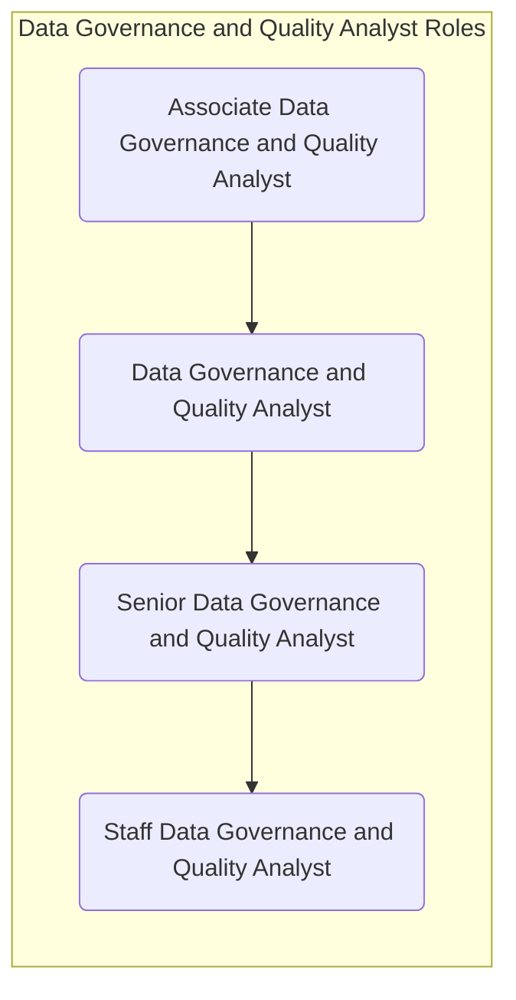
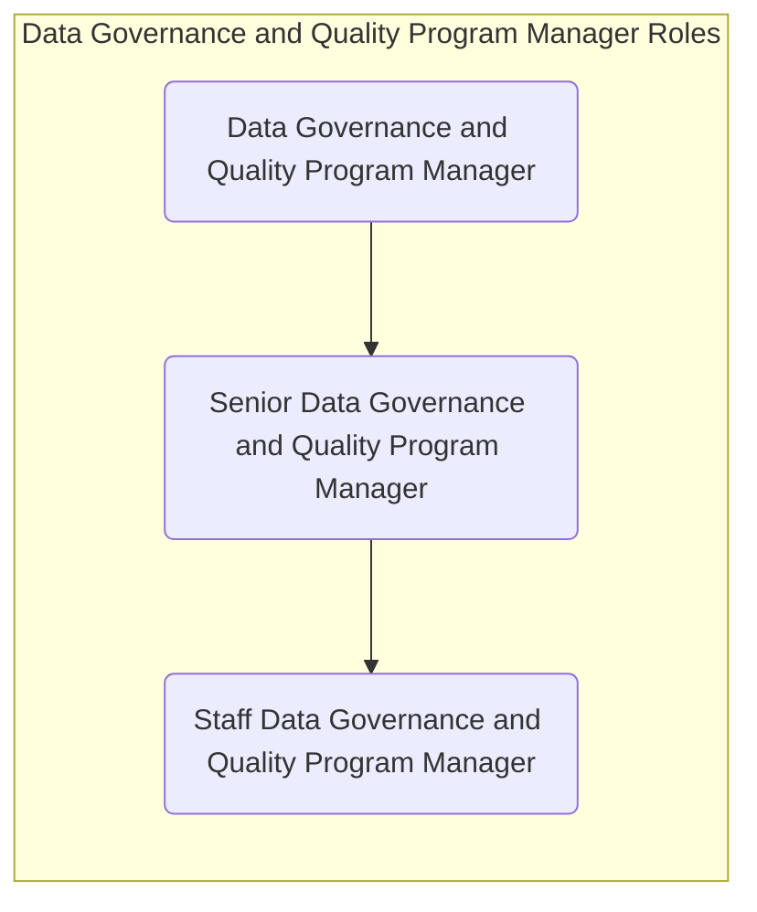
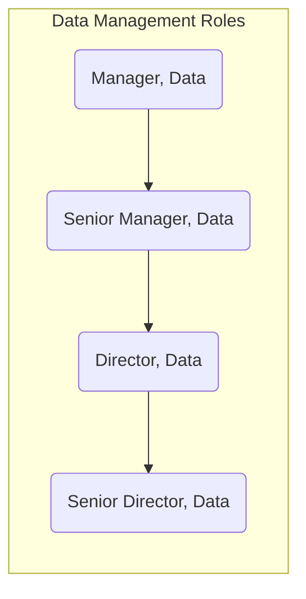

---

## Data Team Organization

The Data Team Organization model is guided by three primary business needs:

1. The need for **bespoke data solutions** unique to the GitLab business.
1. The need for **high-performance and reliable data storage and compute** platform to support distributed analyst teams.
1. The need for centers of excellence for **data technologies** and **advanced analytics**.
1. The need for flexible data solutions driven by varying **urgency and quality** requirements.
1. The need to foster **trust, compliance and value driven** insights. 

Based on these needs, the Data Team is organized in the following way:

1. **Data Pods:** Pods are assembled to provide concentrated focus on delivering & maintaining **data products** for **strategic company initiatives**. Pods are staffed with multiple data personas including Data Analyst, Data Scientist, Analytics Engineer, and supported by Data Engineer as stable counterpart.
1. **[Analytics Engineering](/handbook/enterprise-data/#analytics-engineering-team):** Transform raw data into clean, structured, and usable formats for data decision-making. The Lead Analytics Engineer serves as a stable counterpart for business departments and functional analytics teams.
1. **[Data Platform & Engineering Team](/handbook/enterprise-data/#the-data-platform--engineering-team):** **Center of Excellence** for data technologies, including owning and operating the Data Stack
1. **[Data Science Team](/handbook/enterprise-data/#the-data-science-team):** **Center of Excellence** for advanced analytics, including delivery of data science projects to the business
1. **[Data Governance and Data Quality Team](/handbook/enterprise-data/):** Help build robust data governance practices and establish data quality frameworks for data quality monitoring and data quality improvement. 

## Data Pod Assignments

| POD                       | Data Product Manager | Analytics Engineer                     | Data Analyst    | Data Scientist |
| ------------------------- | -------------------- | -------------------------------------- | --------------- | -------------- |
| Company KPIs              |  @iweeks          | @dantenel @chrissharp @annapiaseczna @j_kim    | @annie-analyst  |                |
| Customer Intelligence     |  @nmcavinue          |                                | @jonglee1218      |                |
| Customer Product Adoption |  @mdrussell             | @michellecooper @utkarsh060 @lisvinueza |                 |                |

## Analytics Engineering - Stable Counterpart Assignments

| Department / Division | Functional Analytics Team / Steering Committee | Analytics Engineer      |
| ---------------- | --------------------------------- | ----------------------- |
| Sales            |  Revenue Strategy and Analytics   |  @j_kim @dantenel       |
| Marketing        |  Marketing Strategy and Analytics |  @dantenel              |
| Finance          |  FP&A Analytics                   |  @annapiaseczna         |
| Customer Success |  CS Strategy and Analytics        |  @mdrussell             |
| Product          |  Product Data Insights            |  @michellecooper        |
| Engineering      |  Engineering Analytics            |  @michellecooper        |
| Security         |  Engineering Analytics            |  @michellecooper        |
| Support          |  N/A                              |  @michellecooper        |
| People           |  People Analytics                 |  @rakhireddy            |
| R&D              |  Product Usage Data Architecture Steering Committee | @pempey |

## Data Platform Team Stable Counterpart Assignments

| POD | Data Engineer |
| --- | ------------- |
| Enterprise Metrics | @csnehansh |
| Customer Intelligence | @rigerta |
| Customer Product Adoption | @juwong |

### Manager, Data

In support of the Data Pod, the Manager, Data fulfills the below responsibilities from the [Senior Manager, Data](/job-families/marketing/enterprise-data/manager-data/#senior-manager-data) Job Responsibilites:

1. Works with the Director, Data to envision and draft Quarterly Objectives, driven by requirements gathered from multiple business partners.
1. Monitor, measure, and improve key aspects of the Data Pods.
1. Regularly meet with business partners to understand and solve for data needs.
1. Serve as a primary or back-up Maintainer on the Data Team Project. Provide final review, feedback, and approval of Merge Requests submitted by the Data Pod and stable counterparts.

### Lead Analytics Engineer (Stable Counterparts for the Business)

In support of the Data Pod and Stable Counterpart relationships, the Lead Analytics Engineer fulfills the below responsibilities from the [Senior Analytics Engineer](/job-families/marketing/enterprise-data/analytics-engineer/#senior-analytics-engineer-responsibilities) Job Responsibilites:

1. Own one or more stakeholder relationship in Go To Market, Research & Development, General & Administrative, Financial Analytics, or Engineering Analytics business functions.
1. Co-DRI of Key Results along with the Manager, Data.
1. Lead [work breakdown](/handbook/enterprise-data/how-we-work/planning/#work-breakdowns) sessions for OKRs.
1. Work with functional stakeholders to prioritze `P3-Other` issues.
1. Serve as a primary or back-up Maintainer on the Data Team Project. Provide final review, feedback, and approval of Merge Requests submitted by the Data Pod and stable counterparts.
1. Review the weekly stand-up and provide support as needed to unblock team members and answer questions.

### Data Platform Team Stable Counterpart

Following the GitLab [Stable Counterpart](/handbook/leadership/#stable-counterparts) principles, every **Data Pod** have a **Data Platform Team** Stable Counterpart assigned. The Data Platform Stable Counterpart divides their time, work and priorities between the Data Platform Team and Data Pod (general an average of 50% each, P2-OKR scheduled ahead of the quarter in collaboration with the respective Pod). The Stable Counterpart is aware of the direction and priorities of the Data Pod and when needed brought into discussion with the Data Platform Team. I.e. when there is a bigger demand than the Stable Counterpart can handle in the assigned availability or architectural direction needs to change. The Stable Counterpart recognize, flags and address this with the applicable stakeholders (in general the Lead/DRI of the Data Platform Team and the Data Pod).

The stable counterpart is expected to participate in the following meetings asynchronously or synchronously. When in doubt, please reach out to the Data Pod Manager to learn which meetings on the calendar you should participate in. In general, the meetings in scope are as follows:

1. Data Pod Iteration Planning Meetings.
1. Data Pod Team Meetings.

## Data Program Recruiting

Recruiting great people is critical to our success and we've invested much effort into making the process efficient. Here are some reference materials we use:

- [Data Roles and Career Development](/handbook/enterprise-data/organization/#data-roles-and-career-development) to help existing team members and prospects understand growth opportunities
- a [Take Home Test](/handbook/enterprise-data/organization/#data-roles-and-career-development) that we ask each candidate to complete; this test is good for the candidate and for us because it represents the type of work we perform regularly and if the candidate is not interested in this work it helps them make a more informed decision about their application

## Data Roles and Career Development

### Data Internships

See [Data Team Internships](/handbook/enterprise-data/organization/internships/).

### Data Platform

- [Data Engineering Job Family](/job-families/marketing/enterprise-data/data-engineer/)

#### Intermediate and Senior Data Engineer Onboarding Timeline

| By Day 30 | By Day 60 |  By Day 90 | By Day 120 |
| ------ | ------ |------ |------ |
| Complete People and Data Onboarding | Perform [triage](/handbook/enterprise-data/how-we-work/triage/) activities | Extract [new data sources](/handbook/enterprise-data/how-we-work/new-data-source/) | Own a specific area of the data platform |
| Create a MR to contribute to handbook or templates | Investigate incidents and issues | Work on [OKR assignments](/handbook/enterprise-data/how-we-work/planning/#quarterly-okr-planning) | Propose new ideas and come up with Data Platform improvement initiatives |
| Understand the current setup of the data platform | Make small/corrective changes to the platform infrastructure or data pipelines | Contribute on work breakdown | |

### Data Analyst

- [Data Analyst Job Family](/job-families/marketing/enterprise-data/data-analyst)

#### Intermediate and Senior Data Analyst Onboarding Timeline

| By Day 30 | By Day 60 |  By Day 90 | By Day 120 |
| ------ | ------ |------ |------ |
| Complete People and Data Onboarding | Extend an existing Tableau dashboard or complete the triage phase for a dbt issue | Run a project end-to-end as DRI with support from a Data Fusion Team | Create ERDs/Data Artifacts (e.g. dashboards) or complete a product evaluation|
| Start attending [Data Fusion Team](/handbook/enterprise-data/#data-fusion-teams) and Business Team synchronous meetings | Perform [triage](/handbook/enterprise-data/how-we-work/triage/) activities | | |
| Complete First Issue: S to M T-Shirt Size  |  |  |  |

### Data Science

- [Data Science Job Family](/job-families/marketing/enterprise-data/data-science)

#### Intermediate and Senior Data Scientist Onboarding Timeline

| By Day 30 | By Day 60 |  By Day 90 | By Day 120 |
| ------ | ------ |------ |------ |
| Complete People and Data Onboarding | Meet stakeholders across the organization | Re-train or enhance an existing data science model |  Make a contribution to improve the Data Science handbook, packages, or processes |
| Start attending Data Science Team meetings | Refine/improve one data science dashboard | Work on [OKR assignments](/handbook/enterprise-data/how-we-work/planning/#quarterly-okr-planning) | Take ownership of at least one quarterly OKR |
| Understand the current data science systems and processes |  | |  |

### Analytics Engineering

- [Analytics Engineering Job Family](/job-families/marketing/enterprise-data/analytics-engineer)

#### Intermediate and Senior Analytics Engineer Onboarding Timeline

| By Day 30 | By Day 60 |  By Day 90 | By Day 120 |
| ------ | ------ |------ |------ |
| Complete People and Data Onboarding  | Extend an existing dbt [Trusted Data Models](/handbook/enterprise-data/how-we-work/data-development/#trusted-data-development) | Run a project end-to-end as DRI with support from a Data Fusion Team | Create ERDs/Data Artifacts|
| Start attending Data Fusion Team and Business Team synchronous meetings | Perform [triage](/handbook/enterprise-data/how-we-work/triage/) activities | | |
| Complete First Issue: S to M T-Shirt Size  |  |  |  |

### Data Governance and Data Quality

#### Data Governance and Quality Analyst Job Family

- [Data Governance and Quality Analyst Job Family](/job-families/marketing/enterprise-data/data-governance-and-quality-analyst)

#### Intermediate and Senior Data Governance and Quality Analyst Onboarding Timeline

| By Day 30 | By Day 60 |  By Day 90 | By Day 120 |
| ------ | ------ |------ |------ |
| Complete People and Data Onboarding | Take up tasks related to assigned program | Own epic / KR from planning to execution | Own specific data domain for data governance and data quality improvement |
| Fully understand the data governance and data quality program, priorities and its strategy | Investigate incidents and issues | Work on [OKR assignments](/handbook/enterprise-data/how-we-work/planning/#quarterly-okr-planning) | Collaborate cross functionally and identify areas for improvement |
| Create a MR to contribute to handbook or templates |  |  |  |

### Data Governance and Quality Program Manager Job Family

- [Data Governance and Quality Analyst Job Family](/job-families/marketing/enterprise-data/data-governance-and-quality-program-manager)

### Data Management

- [Data Management Job Family](/job-families/marketing/enterprise-data/manager-data/)

#### Data Manager Onboarding Timeline

| By Day 30 | By Day 60 |  By Day 90 | By Day 120 |
| ------ | ------ |------ |------ |
| Complete People, Data, and Manager Onboarding | Meet everyone on the team and business data champions | Complete a Team Assessment | Draft a people development Roadmap |
| Understand the current setup of the data platform | Work on [OKR assignments](/handbook/enterprise-data/how-we-work/planning/#quarterly-okr-planning) and map them to the data platform | Lead discussions with Users/Stakeholders on initiatives and OKRs | Draft a program development Roadmap (Process Improvements /Future State) |
| Add a new page to the handbook | Make regular contributions to the handbook spanning your area of management | Become DRI for major portions of the Data Handbook | System/Application Change Control Management of one or more modules |

## Tool Technology Tandem

Tool Technology Tandems (TTT) are supporting to get the maximum value out of business opportunities we have in the Data Program. TTT are experts in a specific (software) tool or technology to support business opportunities or challenges we have by leveraging the tool or technology to the maximum. Although this is not the goal, we want to get the maximum value out of our technology stack. At the moment we see that we are not leveraging our technology stack to the maximum, where there are useful features or opportunities in our technology that could support in fulfilling business opportunities.

The reason is that from the technology side we don't know the business and from the business side we don't know the technology. The TTT will bridge this gap by understanding the needs and bring this together in a technological way. We expect from TTT to do consulting, guiding and educating.

Note: TTT will **not** search for business opportunities to use any tool feature. TTT has to understand business opportunities and translate this into what software could bring to the table.

A single TTT consists of minimum 2 and maximum 3 GitLab Team Members with different roles. There are no requirements in which team a Team Member is part  of(so this could be outside of the central Data Team as well) as long as the TTT meets the expectations described below.

| Tool / Technology | Tandem |
| ----------------- | ------ |
| Snowflake         | t.b.d. |
| Monte Carlo       | t.b.d. |
| dbt               | t.b.d. |
| Tableau           | t.b.d. |

### What do we expect from TTT

- We expect TTT to get in touch with our business partners and all functions that contribute to the data program or work with our Data Platform, to understand their challenges.
- We expect TTT to get up to date with the latest in their area. They understand the full capabilities of the tool / technology, have regular touchpoints with the respective vendor and have a good understanding of the latest released features.
- TTT will guide and educate our business partners.
- TTT will initiate [design-spikes](/handbook/enterprise-data/how-we-work/#design-spike) for quarterly [planning](/handbook/enterprise-data/how-we-work/planning/).
