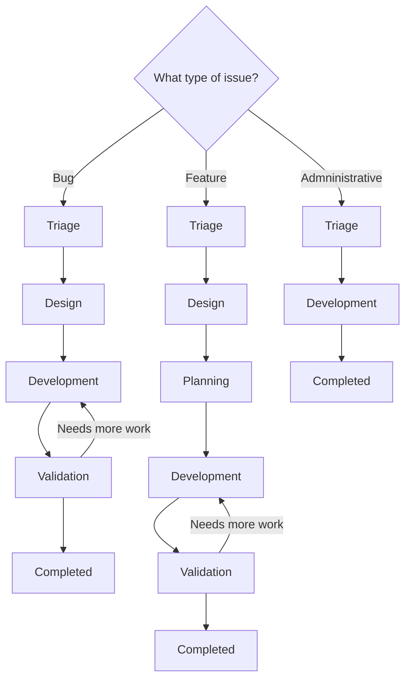
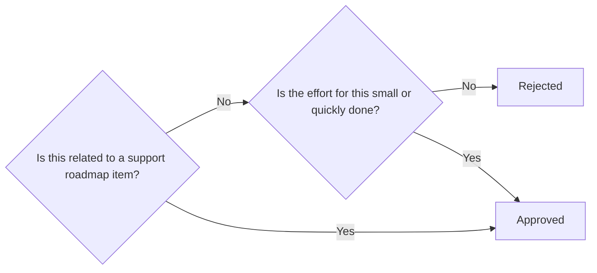
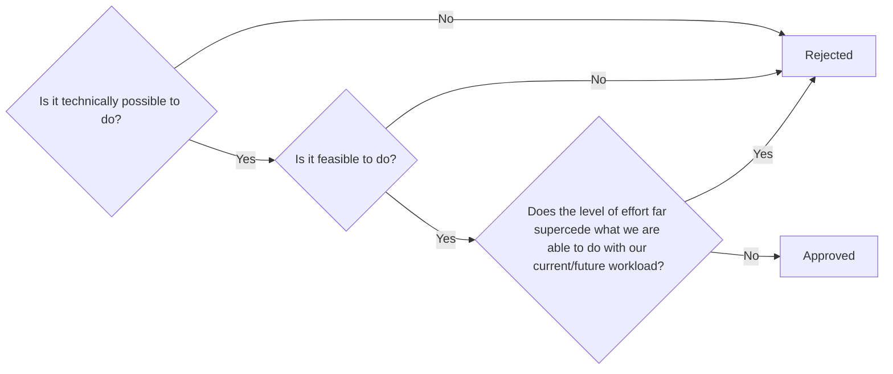

{}

This does not apply for `Incident` type issues. Please see our [incident workflow](../incidents) for more information on those.

{}

The work to be done on an issue largely depends on the _stage_ the issue is in. Please note the _assignee_ on an issue will change _frequently_ as it moves from stage to stage.

## Stages

A standard stage progression (ignoring rejections) for an issue (ignoring the `Blocked` stage), will look like this:

### Triage

- Stage DRI: Dylan

Here the DRI will gather the needed information from the request (if required) and determine if we can move forward on the issue.

This is done using this flowchart:

If any labels are missing from the issue, the DRI should add them at this time.

If we cannot proceed, the DRI will state why on the issue via a comment and close the issue.

If every is good to go, the DRI will move the stage to `Design`.

### Design

{}

This stage is skipped if it is a `Administrative` type issue

{}

- Stage DRI: Jason

Here, the DRI will write up a gameplan for the issue (and post it on the issue as a comment). If any labels are missing from the issue, the DRI should add them at this time.

Once the gameplan is writting up, the DRI will then determine if we can proceed with the issue using the following flowchart:

If we cannot proceed, the DRI will state why on the issue via a comment, set the stage back to `Triage`, and close the issue.

If everything is good to go, the DRI will move the stage to `Planning`.

### Planning

{}

This stage is skipped if it is a `Bug` or `Administrative` type issue

{}

- Stage DRI: Lyle, Dylan, and Jason

Here the DRIs will discuss implementation timelines for the changes. This is done on a monthly cadence (first Monday of the month).

Once determined, a milestone will be added to the issue stating the deployment period.

When the development period has started, the `Development` stage DRI will be assigned the issue.

### Development

- Stage DRI: Assigned in planning stage

It is here you will work on implementing the changes into the correct place for testing. This is normally the sandbox. As you perform changes, please indicate what was changed (and where) as comments on the issue (ideally in one thread).

Once you have gotten everything setup and done your testing, you will change the stage to `Valdiation`. Ensure when you do, you ping the issue requester asking them to perform their validation (make sure to indicate where to perform said validation).

### Validation

{}

This stage is skipped if it is a `Administrative` type issue

{}

- Stage DRI: Issue requester

Here, the requester of the issue validates the changes we have made will resolve their request. This is traditonally done in a sandbox environment.

If the issue requester states it has problems, your task is to move the stage back to `Development` to look into fixing the problems.

If the issue requester validates the changes, you will then push the changes to the needed systesm (be it the systems itselves, merging MRs into production, etc.).

### Completed

This indicates the work is done. An issue to moved to this stage by us when all changes are made in production (or queued up for the next deployment).

The only work left to be done in this stage is to close the issue

### Blocked

This is a special stage that is used when something has blocked all movement on an issue. This could be related to missing approvals, waiting on a tool to be procurred, etc.

In this stage, your task is to check on what is blocking it to determine if it is ready to be unblocked.

If it is ready to be unblocked, move it back to the last stage it was in prior to being moved to the Blocked Stage.
